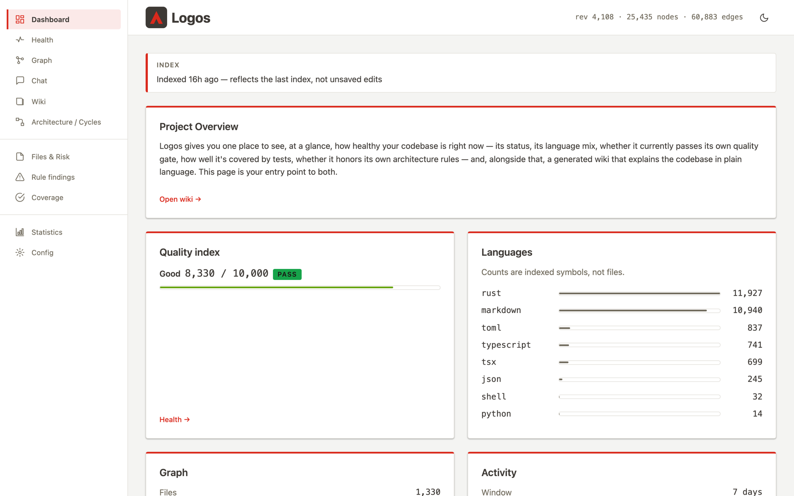

<p align="center">
  
</p>

<h1 align="center">Logos</h1>

<p align="center">
  <strong>Yet Another Graph-based Tool for AI Agent code navigation and quality enforcement</strong>
</p>

<p align="center">
  <a href="https://github.com/raffaelecamanzo/logos/releases/latest"></a>
  <a href="LICENSE"></a>
  
  
  
</p>

<p align="center">
  <a href="#install">Install</a> ·
  <a href="#quick-start">Quick start</a> ·
  <a href="#what-you-can-ask">What you can ask</a> ·
  <a href="#configuration">Configuration</a> ·
  <a href="docs/howto/README.md">Documentation</a>
</p>

---

Logos turns your repository into a **queryable code graph** — every symbol, call,
import, route and doc reference — and serves it to your AI coding agent over
[MCP](https://modelcontextprotocol.io), to you on the command line, and in a local
web dashboard.

An agent without it greps, opens a file, greps again, and guesses where the edges
are. An agent with it asks one question — *what does this task touch?* — and gets
back the ranked, code-carrying answer in a single call. You plan with the real
blast radius instead of a hunch, and your context window goes to the work instead
of the search.

- **One static binary.** No daemon, no account, no cloud, no runtime dependencies.
  SQLite and twelve tree-sitter grammars are compiled in.
- **Local by default.** The graph lives in `.logos/` next to your code. Nothing
  leaves your machine unless you switch on the optional LLM chat and point it at
  an endpoint yourself.
- **Never guesses.** A call edge is recorded only when exactly one candidate
  matches. An ambiguous reference yields no edge, not a plausible wrong one.
- **Deterministic.** Same tree in, same graph and same metrics out, bit for bit.

<p align="center">
  <picture>
    <source media="(prefers-color-scheme: dark)" srcset="assets/readme/dashboard-dark.png">
    
  </picture>
</p>

## Install

**Homebrew** (macOS):

```bash
brew install raffaelecamanzo/tap/logos
```

**Shell installer** (macOS and Linux) — picks the right build for your machine:

```bash
curl -fsSL https://github.com/raffaelecamanzo/logos/releases/latest/download/logos-installer.sh | sh
```

It installs to `~/.cargo/bin` when that exists, otherwise `~/.local/bin`.

<details>
<summary><strong>Manual download, or build from source</strong></summary>

**Manual download.** Grab the archive for your platform from the
[Releases page](https://github.com/raffaelecamanzo/logos/releases), unpack it and
put `logos` on your `PATH`.

| Platform | Target | Minimum |
|---|---|---|
| macOS, Apple Silicon | `aarch64-apple-darwin` | macOS 11 |
| macOS, Intel | `x86_64-apple-darwin` | macOS 10.12 |
| Linux x86_64 | `x86_64-unknown-linux-musl` | any distro, kernel ≥ 3.2 |
| Linux ARM64 | `aarch64-unknown-linux-musl` | any distro, kernel ≥ 3.2 |

Linux builds are fully static (musl): the same file runs on Alpine, Debian, NixOS or
a scratch container. Windows is not supported yet.

**From source.** You need a recent stable Rust toolchain. Node is needed only if
you want the web dashboard compiled in:

```bash
git clone https://github.com/raffaelecamanzo/logos.git && cd logos
(cd web/ui && npm ci && npm run build)          # the dashboard bundle
cargo install --path cli --features agents      # CLI + MCP + dashboard + chat
```

Drop `--features agents` for a build with no outbound HTTP client at all. The
dashboard still works; only the LLM-backed Chat and wiki generation go away. See
[Installation](docs/howto/installation.md) for every build variant.

</details>

Check it:

```bash
logos --version
logos languages      # the compiled-in grammars
```

## Quick start

From the root of any project:

```bash
logos init -i        # set up .logos/, wire the MCP server into .mcp.json, add git hooks
logos index          # build the graph
```

Restart your agent. The `logos:*` tools appear on their own, and the git hooks keep
the graph in sync as you commit, check out and merge.

Using a host other than Claude Code? Point any MCP client at the stdio server:

```bash
logos --project /path/to/project serve --mcp
```

Then open the dashboard:

```bash
logos serve --ui     # http://127.0.0.1:4983
```

## What you can ask

Logos is built for the moment **before** the work is split up — when a plan is
cheapest to get right.

| The question | The command (and MCP tool) |
|---|---|
| **What does this task touch?** | `logos context "add pagination to the users endpoint"` |
| **Can these two changes run in parallel?** | `logos impact-intersection --item pag=list_users --item auth=require_session` |
| **Has this already been done here?** | `logos precedent src/api/users.rs` |
| **How big is this change, really?** | `logos impact <symbol>` · `logos affected <file>…` |
| **Which branches collide — and did the merge carry everything?** | `logos branch-overlap --ref feat-a --ref feat-b --merge main` |

And while you edit: `search`, `node`, `callers`, `callees` and `explore` navigate by
structure instead of by string. Every CLI command has an MCP twin that returns the
same payload, and every one takes `--json`.

**Twelve languages** out of the box: Rust, Python, TypeScript/JavaScript (incl.
TSX/JSX), Go, Java, C, C++, C#, Kotlin, Scala, Ruby and PHP. Markdown docs and ten
config formats (YAML, JSON, TOML, Dockerfile, Makefile, Shell, Protobuf, GraphQL,
Terraform, SQL, plus OpenAPI) are indexed too, so you can ask which code implements
a requirement, or which docs a change will make stale.

## Keep the architecture honest

The same graph scores your codebase on ten structural dimensions (modularity,
acyclicity, depth, redundancy, cohesion and more) and rolls them into a single
**0–10,000 quality signal**. Declare your rules and Logos enforces them:

```bash
logos check          # evaluate .logos/rules.toml — exits 1 on a violation
logos gate --save    # bless a baseline at release...
logos gate           # ...and fail CI when a change regresses it
```

`logos init --hooks` installs a `pre-push` gate, and
[CI integration](docs/howto/ci-integration.md) has a copy-paste pipeline.

## The dashboard

`logos serve --ui` opens a local web app over the same graph:

- **Dashboard** and **Health** — the quality signal, language mix, test coverage
  and rule findings at a glance.
- **Graph** — an interactive, filterable view of symbols, docs and config.
- **Architecture** — dependency cycles and layering violations.
- **Files & Risk** — churn × complexity hotspots, joined with coverage.
- **Chat** — ask compound questions about your codebase. A planner sends read-only
  sub-agents over the graph and the source, then writes back an answer with
  tables and diagrams.
- **Wiki** — a generated, always-anchored explanation of your codebase.
- **Workspace** — index a folder of sibling repos (`logos init --workspace`) and
  see the REST and message-broker couplings *between* services.

It listens on loopback only, and the whole app is embedded in the binary.

## Configuration

**None is required.** Logos indexes every supported language and respects
`.gitignore` out of the box. Everything lives in `.logos/`:

| File | What it holds | Commit it? |
|---|---|---|
| `.logos/config.toml` | What to index, and the Chat/wiki model settings | Yes |
| `.logos/rules.toml` | Your architecture contract: budgets, layers, boundaries | Yes |
| `.logos/secrets.toml` | The chat API key (written `0600`, gitignored by `init`) | **No** |
| `.logos/*.db` | The derived graph, history and wiki stores | No |

A typical `config.toml`:

```toml
exclude = ["vendor/**", "**/*.generated.ts"]    # unioned with .gitignore

[chat]                                          # optional: the LLM-backed Chat tab
provider = "openai"                             # "openai" (any OpenAI-compatible API) | "anthropic"
base_url = "https://openrouter.ai/api/v1"       # the default
model    = "anthropic/claude-sonnet-4"
```

A starting `rules.toml`:

```toml
[constraints]
max_cycles   = 0     # no dependency cycles
max_cc       = 15    # cyclomatic complexity per function
max_fn_lines = 80    # lines per function
```

Set the chat API key in the dashboard's **Config** tab, which stores it masked and
never shows it again. The same tab edits both policy files with validation, so an
invalid value is rejected before it is saved. Full reference:
[Configuration](docs/howto/configuration.md).

## Documentation

| | |
|---|---|
| [Installation](docs/howto/installation.md) | Platforms, build variants, verification |
| [Usage](docs/howto/usage.md) | Indexing, navigation, MCP setup, the dashboard, worktrees |
| [Commands](docs/howto/commands.md) | Every subcommand, with its flags and JSON shape |
| [Configuration](docs/howto/configuration.md) | `config.toml`, `rules.toml`, workspaces, Chat |
| [Metrics](docs/howto/metrics.md) | The ten dimensions behind the quality signal |
| [CI integration](docs/howto/ci-integration.md) | The freshen → enforce → report → bless loop |
| [Error handling](docs/howto/error-handling.md) | Exit codes and troubleshooting |

## License

Logos is licensed under the [Apache License 2.0](LICENSE). Third-party attributions
ship in [THIRD-PARTY-NOTICES.md](THIRD-PARTY-NOTICES.md).
